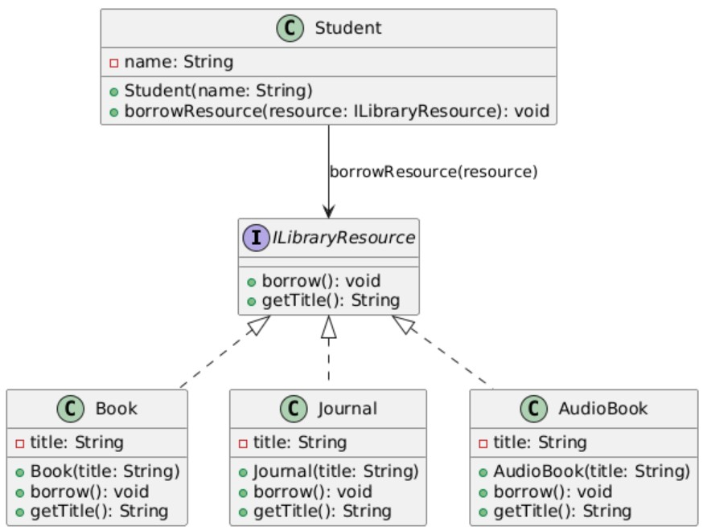

# NEU Library System - SOLID & DIP Compliant

---

## Table of Contents

- [Overview](#overview)
- [Problem Statement](#problem-statement)
- [Proposed Solution](#proposed-solution)
- [UML Class Diagram](#uml-class-diagram)
- [Implementation](#implementation)
- [Test Program](#test-program)
- [How to Run](#how-to-run)
- [Benefits](#benefits)
- [License](#license)

---

## Overview

This project refactors the NEU Library System to follow **SOLID principles**, particularly focusing on the **Dependency Inversion Principle (DIP)**. The system allows students to borrow various types of library resources—books, journals, audiobooks—while ensuring that adding new resource types in the future requires minimal changes.

---

## Problem Statement

The current implementation of the NEU Library System has a `Student` class with methods that directly depend on specific resource types like `borrowBook(title)` or `borrowJournal(title)`. 

**Issues with the current design:**

1. High coupling between `Student` and resource classes.
2. Adding new resource types requires modifying the `Student` class.
3. Violates the **Open-Closed Principle (OCP)** and makes maintenance harder.

**Goal:** Refactor the system to use abstractions so that `Student` can borrow any type of resource without directly depending on concrete classes.

---

## Proposed Solution

1. Introduce an interface `ILibraryResource`:
   - All resource types implement this interface.
   - Defines standard methods like `borrow()` and `getTitle()`.

2. Refactor `Student` to depend on `ILibraryResource` instead of concrete classes.

3. Implement resource classes (`Book`, `Journal`, `AudioBook`) that implement `ILibraryResource`.

4. The system can now accommodate new resources such as `EJournal` or `AudioBook` without modifying existing code.

---

## UML Class Diagram

  

